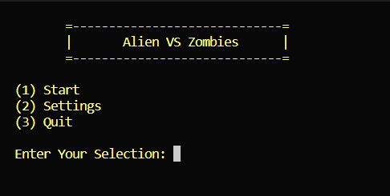

# Alien vs. Zombie

A text-based game based on 'Alien Path' named ALIEN VS ZOMBIES

[Video Demo](https://youtu.be/fxl4hhwuUqY).

## Compilation Instructions

To compile, run the command into the console or cmd:

g++ main.cpp includes/display.cpp includes/helpers.cpp includes/settingsLogic.cpp includes/Board.cpp includes/Alien.cpp includes/GameObject.cpp includes/saveLoadQuit.cpp -o main

## User Manual

Please provide the user manual on how to use your program.

1. First we have to compile it using the command given above
2. Run the main.exe file in the terminal or cmd, e.g. ./main.exe
3. From there the players will be brought to a main menu where they will be prompted to insert an action

Please DO NOT change the Progress Log below. Leave it as it is.

## Progress Log

- [Part 1](PART1.md)
- [Part 2](PART2.md)

## Contributors

Please replace the following with your group members' names. 

- Muhammad Azhan Hakimi Bin Zulhani
- Syed Thahir Alhabshi Bin Sayed Ahmad
- Muhammad Ismail Bin Suhaini

